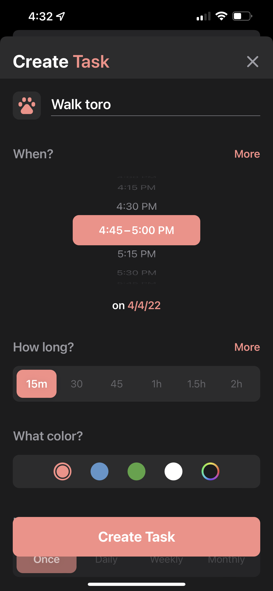
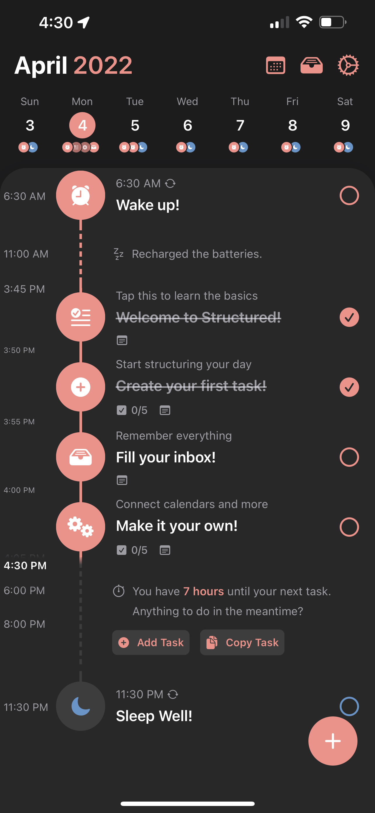

# MVP Design And Requirements

# Overview

This app's main focus is to assist user in building good habits as well as managing their daily schedule.
- **MVP**: 
    - Allow users to input habits they want to achieve daily/weekly (E.g. work on personal coding project for 4 hours daily) and schedule them. 
    - Track user's progress and display them with information chart and graphs
    - Notify/remind users to perform their habits
    - Ability to work offline using PWA

- **Extra features**:
    - Have goals or achievements to gamify and increase encouragement in the process
    - Use machine learning to automatically plan their schedule or adjust it based on past data of when they completed their habits

# Possible Designs (Inspirations)

### Colors:

- Salmon: #FEB498
- Blue: #6365FF
- Yellow: #FDD180
- Pink: #FE91C4

# MVP Features/Requirements

- **Main Features**
    - **Calendar**
        - [ ] Shows user activities or todos that they planned to do throughout the day in time blocks
        - [ ] Able to switch between daily view and weekly view
        - Add new activities/habits
            - [ ] When adding new activities, user will be required to input a description, a time block reserved for the activities, select a type for that activity, if that activity is recurring (how often that activity is recurring i.e. everyday, 4 days, etc...), if you want to track this activity or not
        - Remind user when to start activities
            - [ ] PWA to access notifications as well as ability to use app offline
        - [ ] Have a button for user to press to track when user start activity and when user is finished with a certain activity
        - [ ] Dynamically adjust activities time slot to accommodate for changes to daily schedule like new activities or changing existing activities time slot.
    - **Dashboard**
        - User can see stats of their habits
            - [ ] How many consecutive days they stick to their habits plans
            - [ ] How many hours they spend on each habit or all habits (time spent being productive) in total for a certain week
            - [ ] Their progress in making that habits (i.e. sticking to their habits for 2 weeks)
            - [ ] Time spent being unproductive or not sticking to their habit plans
            - [ ] How much they improve on sticking to their habits compared to previous weeks
        - See upcoming habits or important events
            - Display incoming habits or events in a chronological, scrollable list 
        

# Tech Stacks

- **Front End**
    - UI Framework → Angular
    - CSS Framework → Bootstrap, SCSS
- **Back End**
    - Language - Go
    - Server-side Framework → Gin
    - Architecture → Microservices
- **Database**
    - NoSQL → MongoDB
- **Container**
    - Containerization → Docker
    - Orchestration - Kubernetes
    - Cloud Provider - AWS